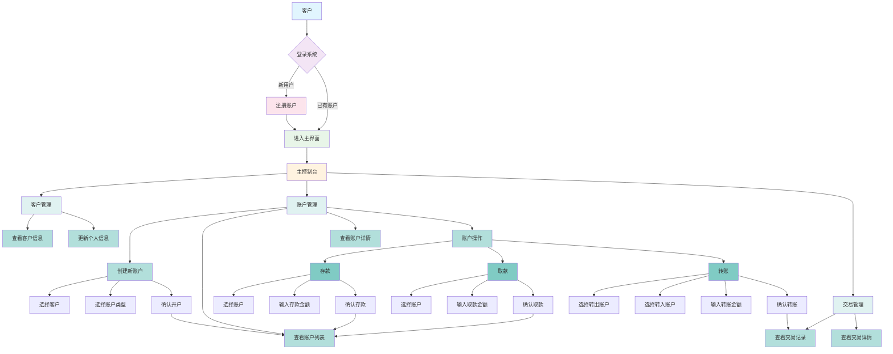

# 银行核心业务流程指南

本文档为客户提供了银行系统核心业务流程的可视化操作指南，帮助客户更好地理解和使用银行服务。

## 银行核心业务流程图

## 详细操作说明

### 1. 登录/注册流程
- **新用户**: 首次使用系统需要进行注册，填写基本信息创建账户
- **已有账户用户**: 直接使用用户名和密码登录系统

### 2. 客户管理
- **查看客户信息**: 查看个人基本信息，包括姓名、身份证号、联系方式等
- **更新个人信息**: 修改个人联系信息，如电话号码、邮箱地址等

### 3. 账户管理
- **创建新账户**: 
  1. 选择已有的客户信息
  2. 选择账户类型（储蓄账户、支票账户、定期账户等）
  3. 确认开户，系统将生成唯一的账户号码
  
- **查看账户列表**: 显示所有账户的概览信息，包括账户号码、类型、余额等
- **查看账户详情**: 查看单个账户的详细信息和状态
- **账户操作**:
  - **存款**: 向指定账户存入资金
  - **取款**: 从指定账户提取资金
  - **转账**: 在不同账户之间转移资金

### 4. 交易管理
- **查看交易记录**: 浏览账户的所有交易历史
- **查看交易详情**: 查看单笔交易的详细信息，包括交易时间、金额、类型等

## 颜色说明
- 蓝色: 客户起点
- 紫色: 登录决策点
- 粉色: 注册流程
- 绿色: 主界面
- 橙色: 主控制台
- 青色: 主要功能模块
- 浅青色: 子功能
- 深青色: 具体操作

通过以上流程图和说明，客户可以清晰地了解银行系统的操作流程，便于快速上手使用各项银行服务。